PROGETTO PSS/Mobile - Roberto Casadei

# Analisi dei Requisiti - Sports Tracker

L'applicazione che si intende sviluppare è un'app di monitoraggio sportivo. Essa si occuperà di tracciare le attività sportive dell'utente, in particolare le sessioni di corsa e bicicletta, e fornire informazioni dettagliate sui percorsi effettuati, come la distanza coperta, le calorie bruciate e la durata.
L'utente potrà salvare e consultare i dati delle sessioni passate per tenere traccia dei propri progressi nel tempo.

## Requisiti Funzionali

- L'app deve permettere di avviare e terminare una sessione di allenamento. Durante la sessione, sarà necessario raccogliere dati sulla posizione dell'utente per tracciare il percorso.

- Alla fine di una sessione, l'utente deve poter vedere su una mappa il percorso seguito durante l'allenamento.

- L'utente deve avere la possibilità di salvare e rivedere le sessioni passate con tutte le informazioni relative, come il percorso, le calorie bruciate e il tempo impiegato.

- L'app deve gestire la registrazione e il login degli utenti, permettendo di mantenere una sessione attiva per facilitare l'accesso ai dati personali, o cambiare utente.

## Requisiti Non Funzionali
- L'app dev'essere sviluppata in modo da poter essere facilmente scalabile.

- Il sistema deve fornire un tracciamento preciso e veloce, in modo da rilevare correttamente i movimenti dell'utente in tempo reale.

- L'app deve offrire un'esperienza utente fluida e semplice, con un'interfaccia che permetta l'utilizzo da parte di tutti i tipi di utenti.

# Analisi e modello del dominio
User: rappresenta la persona che utilizza l'applicazione per monitorare i propri allenamenti. Ogni utente puà impostare i propri dati, come:
- Username e password
- Dati sulle proprie caratteristiche fisiche
- Un obiettivo fissato dall'utente, come dimagrire o migliorare la propria forma fisica.

TrainingSession: ogni sessione rappresenta un allenamento dell'utente e contiene dati come:

- Giorno e ora in cui è stata effettuata la sessione.  
- Tempo totale dell'allenamento.  
- Distanza totale percorsa in m.  
- Tipologia di sport: corsa o bicicletta

Location: rappresenta i punti geografici registrati durante un allenamento. Ogni punto è caratterizzato da:  
- Latitudine e longitudine 
- Ora esatta in cui è stato registrato il punto.

CalendarTraining: ogni allenamento salvato dall'utente nel calendario. caratterizzati da:
- Data
- Descrizione

## Relazioni tra le entità
Un utente può avere diverse sessioni di allenamento.
Ogni sessione di allenamento ha un percorso associato.

### Sfide del dominio
La sfida principale è creare un'applicazione fruibile, in cui ogni pagina è facilmente raggiungibile e in cui l'utente ha il controllo sui propri dati e su quelli delle proprie sessioni. Inoltre tutti i percorsi degli allenamenti dovranno essere disegnati sulla stessa mappa, con colori differenti.

Un'altra delle principali difficoltà riguardante il tracciamento dei percorsi è la gestione accurata della posizione GPS e della registrazione dei dati in tempo reale, come la frequenza con cui i dati vengono raccolti e memorizzati

La home page inoltre dovrà mostrare tutti gli allenamenti dell'utente correntemente loggato.
La permanenza dello stato di login e la gestione dei dati dell'utente è un altro aspetto a cui presteremo particolare attenzione

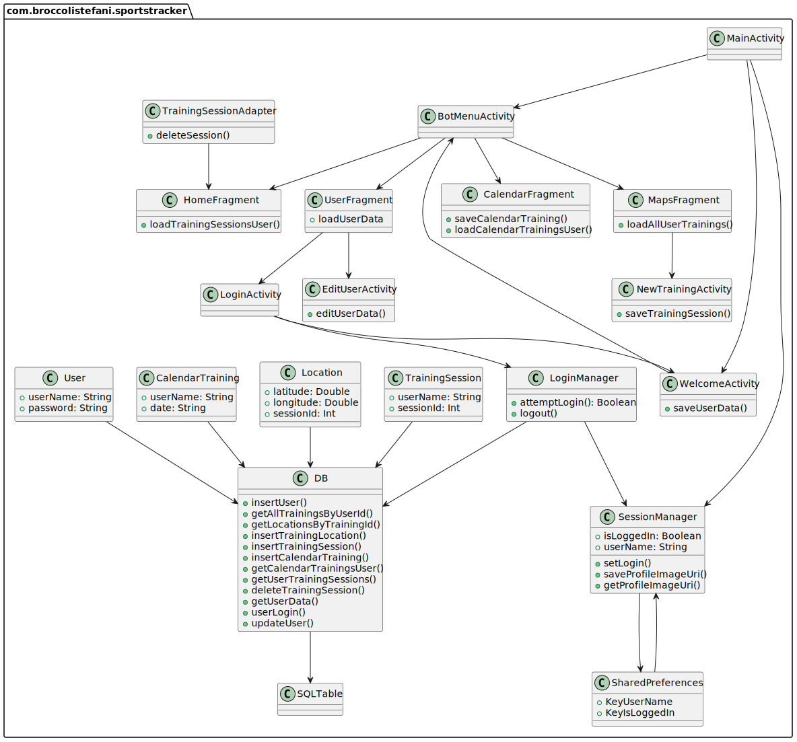

# Design
## Architettura
La struttura dell'app segue il pattern Model-View-ViewModel (MVVM), che garantisce una separazione chiara tra la logica di business, la gestione dei dati e l'interfaccia utente. Le principali componenti dell'app interagiscono nel seguente modo:

- Model: Il Model rappresenta i dati e le operazioni di gestione legate alle sessioni di allenamento e agli utenti. Questo livello include l'accesso al database SQLite, che gestisce informazioni come le sessioni di allenamento e i dati degli utenti. Le operazioni sui dati vengono eseguite tramite repository, che incapsulano la logica di accesso e aggiornamento del database.

- View: La View è costituita dai frammenti e dalle attività dell'applicazione, che rappresentano l'interfaccia grafica con cui l'utente interagisce. Il layout di queste interfacce è pensato per essere semplice e intuitivo, permettendo all'utente di visualizzare le proprie sessioni di allenamento e di accedere rapidamente alle funzionalità principali.

- ViewModel: Il ViewModel funge da intermediario tra la View e il Model. Si occupa di esporre i dati necessari alla View in modo che questa possa osservarli e aggiornarli automaticamente quando cambiano. Ad esempio, il MapsViewModel gestisce i dati relativi alla posizione dell'utente durante l'allenamento, integrando i servizi di localizzazione tramite il FusedLocationProviderClient.

## Interazione tra le componenti
Sessione di allenamento: L'utente avvia una nuova sessione di allenamento tramite l'interfaccia utente. La View comunica con il MapsViewModel per avviare il tracciamento della posizione. Il MapsViewModel, a sua volta, utilizza il Model per salvare e recuperare i dati relativi alla sessione, che sono gestiti dal database SQLite.

Gestione dell'utente: L'autenticazione e la gestione della sessione di login sono affidate a SessionManager. Questo viene utilizzato per mantenere la sessione dell'utente attiva tra le varie esecuzioni dell'applicazione, evitando di richiedere all'utente di effettuare nuovamente il login ogni volta che riapre l'app.
Le modifiche allo stato dell'utente vengono propagate al ViewModel, che aggiorna la View di conseguenza.

# Design dettagliato - Broccoli Gabriele

## MapsFragment 
#### Problema:
L'app deve tracciare il percorso di allenamento degli utenti, mostrando il percorso su una mappa. È inoltre necessario gestire la geolocalizzazione, il salvataggio delle coordinate, e l'aggiornamento continuo della posizione dell'utente durante l'allenamento.

#### Soluzione:
Ho implementato un MapsFragment che utilizza FusedLocationProviderClient per ottenere la posizione dell'utente in tempo reale e visualizzare il percorso su una mappa di Google. Questo fragment è separato dalla logica di business grazie all'uso di MapsViewModel, che gestisce i dati e li aggiorna nel fragment.

#### Pattern Utilizzati:  
MVVM (Model-View-ViewModel): Ho adottato il pattern MVVM per separare la logica dell'interfaccia utente dai dati. Il MapsViewModel funge da ViewModel, mantenendo lo stato del percorso di allenamento e gestendo le interazioni con il servizio di localizzazione.  
Observer Pattern: Il MapsFragment osserva i dati nel MapsViewModel, aggiornando la mappa ogni volta che i dati della posizione cambiano. Questo pattern garantisce che la UI sia sincronizzata con i cambiamenti nei dati senza interazioni manuali.  

#### Motivazioni:  
L'utilizzo di MVVM consente una migliore organizzazione del codice, separando le responsabilità e facilitando il test.  
Il pattern Observer garantisce che la mappa sia aggiornata automaticamente quando i dati cambiano, migliorando l'esperienza utente.

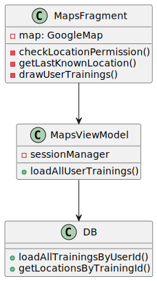

#### UML
Nello schema UML, MapsFragment interagisce con MapsViewModel, che a sua volta si interfaccia con FusedLocationProviderClient per ottenere i dati di geolocalizzazione. L'osservazione tra fragment e ViewModel è illustrata tramite una relazione di dipendenza.

## TrainingSessionAdapter
#### Problema
L'app ha bisogno di una lista che mostri tutte le sessioni di allenamento registrate dall'utente. Ogni sessione deve essere rappresentata con un layout ricco di informazioni e facilmente navigabile.

#### Soluzione
Ho implementato un TrainingSessionAdapter che gestisce la visualizzazione delle sessioni di allenamento in una RecyclerView. Il TrainingSessionAdapter prende i dati dal DBManager e li passa alla RecyclerView per visualizzarli.

#### Pattern Utilizzati
Adapter Pattern: Il TrainingSessionAdapter segue il pattern Adapter per gestire la visualizzazione delle sessioni di allenamento all'interno di una RecyclerView, consentendo una rappresentazione flessibile dei dati.
Motivazioni
L'uso di un Adapter facilita la gestione dei dati in una RecyclerView, fornendo un modo modulare e flessibile di visualizzare e aggiornare le sessioni di allenamento.

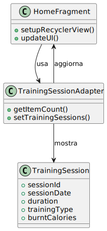

#### UML
Lo schema UML mostra la relazione tra TrainingSessionAdapter, RecyclerView, e TrainingSession, evidenziando come l'adapter media tra i dati e l'interfaccia utente.

## DB

#### Problema
L'applicazione deve salvare in modo persistente i dati delle sessioni di allenamento, associando tali sessioni agli utenti. È necessario poter salvare, modificare, eliminare e recuperare i dati relativi a queste sessioni e agli utenti in modo efficiente.

#### Soluzione
Ho implementato una classe DBManager per gestire l'accesso al database SQLite. Questa classe segue il pattern Repository per separare la logica del database dall'interfaccia utente. Ciò consente un'interazione facile con i dati senza dover gestire direttamente le query SQLite all'interno dell'attività o dei fragment.

#### Pattern Utilizzati
Repository Pattern: La classe DBManager funge da repository centrale, gestendo l'accesso ai dati tramite metodi per creare, leggere, aggiornare e cancellare (CRUD) sessioni di allenamento e utenti. Questo pattern migliora la modularità e consente di astrarre il dettaglio implementativo del database.
Singleton: DBManager viene inizializzato una sola volta per garantire che vi sia una sola istanza che gestisce l'accesso al database, evitando accessi concorrenti e garantendo che tutte le operazioni avvengano in un contesto gestito centralmente.
Motivazioni
L'utilizzo del pattern Repository con un database SQLite offre una struttura ben organizzata per la persistenza dei dati. Questo approccio facilita anche l'aggiunta di nuove funzionalità, come la gestione di ulteriori tipi di dati, poiché è possibile estendere la classe DBManager senza influenzare il resto dell'applicazione.

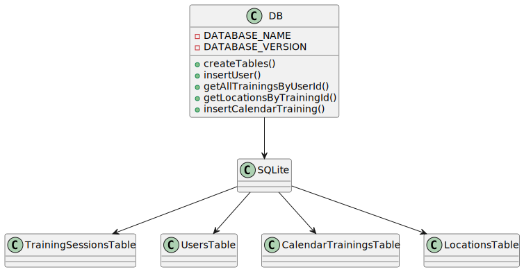

#### UML
Lo schema UML mostra la relazione tra DB e le classi User e TrainingSession, evidenziando come il repository gestisce l'accesso ai dati per ciascuna di queste entità.

## NewTrainingSession
#### Problema:
L'applicazione deve salvare in modo persistente i dati relativi alle sessioni di allenamento degli utenti. Questo include la gestione di operazioni di creazione, lettura, aggiornamento e cancellazione (CRUD) dei dati relativi agli utenti e alle loro sessioni. Inoltre, è necessario che l’accesso ai dati avvenga in modo efficiente e che l'integrità delle operazioni sia garantita, specialmente in un contesto multi-thread. Questo è importante per evitare inconsistenze nel database e problemi di concorrenza.

#### Soluzione:
Repository Pattern: La classe DBManager funge da repository centrale, incapsulando tutta la logica di accesso al database e nascondendo i dettagli implementativi delle operazioni CRUD. Questo pattern semplifica l’interazione con i dati, rendendo possibile estendere o modificare le funzioni del database senza influenzare altre parti del codice.
Singleton Pattern: La classe DBManager è progettata come un singleton per garantire che esista un'unica istanza della classe che gestisce tutte le interazioni con il database. Questo previene la creazione di più connessioni contemporanee e facilita la gestione centralizzata dell'accesso ai dati.
Factory Method: Per gestire la creazione delle istanze degli oggetti User e TrainingSession, il DBManager utilizza metodi di factory che costruiscono e restituiscono le istanze corrette a partire dai dati recuperati dal database.

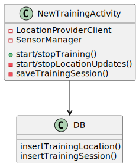

#### UML
Il diagramma UML di DBManager mostra le relazioni tra il repository e le entità chiave (User e TrainingSession). Mostra anche le interazioni che permettono di eseguire operazioni CRUD su questi dati.

# Design dettagliato - Stefani Tommaso

### SessionManager - LoginManager

#### Problema:
Quando un utente riapre l'app non deve essere obbligato a rifare il login ogni volta.
Bisogna quindi gestire le sessioni utente, memorizzando in modo persistente lo stato di login dell'utente e le sue informazioni generali e l'URI dell'immagine profilo.

#### Soluzione:
Il SessionManager utilizza le SharedPreferences per gestire in modo persistente le informazioni della sessione dell'utente. Questo permette di mantenere lo stato di login e recuperare le informazioni anche dopo la chiusura dell'app.

Lo stato di login viene recuperato dalle SharedPreferencies all'apertura dell'app.

#### Pattern utilizzato
Singleton Pattern: SessionManager è implementato come singleton per garantire che ci sia solo un'istanza che gestisce lo stato di sessione dell'utente, evitando conflitti.

#### UML
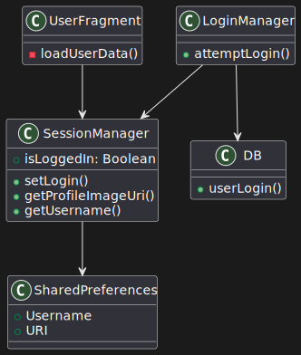

SessionManager gestisce lo stato di login e le informazioni dell'utente, come il nome e l'immagine del profilo, utilizzando SharedPreferences. Permette di accedere in modo centralizzato a questi dati.

### UserFragment

#### Problema:
L'utente deve poter visualizzare e modificare le informazioni del proprio profilo, comprese l'immagine e i dati personali. È necessario anche gestire la persistenza delle modifiche effettuate, e altre funzionalità come il logout e l'aggiunta dell'immagine profilo.

#### Soluzione:
UserFragment fa visualizzare i dati dell'utente e della sua immagine profilo(se precedentemente impostata) e ne consente modifiche.

Gli utenti possono scegliere un'immagine dalla galleria e salvarla.

L'utente può anche disconnettersi tramite il pulsante apposito.

#### Pattern utilizzato
MVVM (Model-View-ViewModel): UserFragment utilizza un ViewModel per gestire i dati, mantenendo separata l'interfaccia utente dalla logica di gestione del profilo.

#### UML
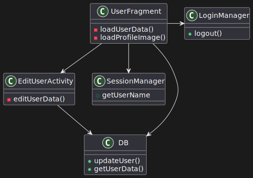

UserFragment gestisce la visualizzazione e l'aggiornamento delle informazioni personali dell'utente, come i dettagli del profilo e l'immagine, fornendo una UI aggiornata automaticamente quando i dati vengono modificati.

### CalendarFragment

#### Problema:
L'utente deve poter visualizzare e salvare allenamenti per le date selezionate nel calendario. Deve inoltre permettere all'utente di vedere se esistono allenamenti precedenti per quella data e aggiungere nuovi allenamenti.

#### Soluzione:
CalendarFragment consente all'utente di interagire con un calendario e salvare sessioni di allenamento per date specifiche.

Gli utenti devono mantenere i propri allenamenti programmati anche quando si cambia tra utenti differenti.

#### Pattern utilizzato
MVVM (Model-View-ViewModel): CalendarFragment utilizza un ViewModel per gestire i dati del calendario, separando la logica degli allenamenti dalla UI.

#### UML
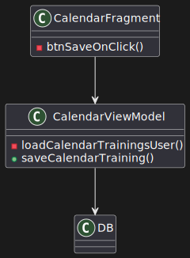

CalendarFragment permette agli utenti di selezionare una data e visualizzare o salvare degli allenamenti. Aggiorna la UI quando viene selezionata una data o salvato un nuovo allenamento.

### WelcomeActivity

#### Problema
L'app ha bisogno di gestire il primo accesso dell'utente, acquisendo i dati personali e verificare se l'utente è già autenticato.

#### Soluzione
Consente all'utente di inserire i dati richiesti. Se l'utente è già loggato, viene automaticamente reindirizzato alla schermata principale. I dati inseriti vengono salvati nel db.

#### Pattern utilizzato
Utilizza direttamente la logica di controllo dello stato e la gestione dei dati all'interno dell'activity stessa per un fattore di semplicità.

#### UML
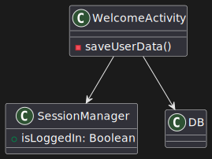

WelcomeActivity gestisce la raccolta delle informazioni dell'utente e verifica se è già loggato tramite il SessionManager. In caso positivo, l'utente viene reindirizzato automaticamente alla schermata principale; altrimenti, può registrarsi inserendo le informazioni necessarie.

### LoginActivity

#### Problema
Permette di eseguire un accesso all'app senza dover necessariamente passare da WelcomeActivity se l'utente è già stato creato

#### Soluzione
Permette all'utente di inserire le credenziali e, tramite il LoginManager, verifica se il login è corretto. I dati dell'utente vengono gestiti dal SessionManager per mantenere l'utente autenticato

#### Pattern utilizzato
gestisce il processo di login e aggiorna lo stato di autenticazione utilizzando direttamente nell'activity per un fattore di semplicità.

#### UML
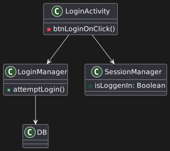

LoginActivity consente all'utente di autenticarsi inserendo nome utente e password. Le credenziali vengono verificate tramite il LoginManager, e se valide, l'utente viene autenticato e viene re-impostato la condizione per il mantenimento del login

### EditUserActivity

#### Problema
L'app ha bisogno di fornire agli utenti la possibilità di modificare i propri dati personali, quali età, altezza, peso, sesso e obiettivo, in modo che le informazioni possano essere aggiornate in qualsiasi momento.

#### Soluzione
La EditUserActivity permette all'utente di visualizzare e modificare i propri dati.

#### Pattern utilizzato
gestisce la modifica e il salvataggio dei dati personali dell'utente direttamente nell'activity per un fattore di semplicità.

#### UML
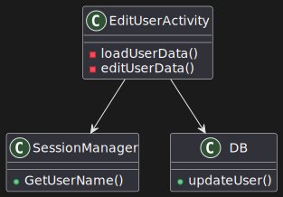

La EditUserActivity gestisce il processo di modifica dei dati personali dell'utente. Carica le informazioni correnti dal database tramite il SessionManager, e consente all'utente di modificare età, altezza, peso, sesso e obiettivi. Una volta apportate le modifiche, queste vengono salvate nel database.

# Sviluppo
## Testing Automatizzato
## Note di sviluppo
# Commenti finali
## Autovalutazione e lavori futuri
# Guida Utente

- Broccoli Gabriele
- Stefani Tommaso