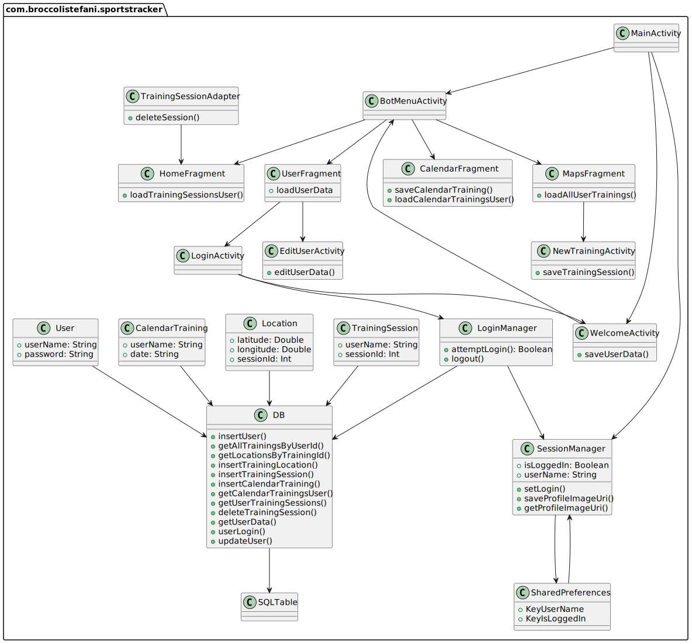

PROGETTO PSS/Mobile - Roberto Casadei

# Analisi dei Requisiti - Sports Tracker

L'applicazione che si intende sviluppare è un'app di monitoraggio sportivo. Essa si occuperà di tracciare le attività sportive dell'utente, in particolare le sessioni di corsa e bicicletta, e fornire informazioni dettagliate sui percorsi effettuati, come la distanza coperta, le calorie bruciate e la durata.
L'utente potrà salvare e consultare i dati delle sessioni passate per tenere traccia dei propri progressi nel tempo.

## Requisiti Funzionali

- L'app deve permettere di avviare e terminare una sessione di allenamento. Durante la sessione, sarà necessario raccogliere dati sulla posizione dell'utente per tracciare il percorso.

- Alla fine di una sessione, l'utente deve poter vedere su una mappa il percorso seguito durante l'allenamento.

- L'utente deve avere la possibilità di salvare e rivedere le sessioni passate con tutte le informazioni relative, come il percorso, le calorie bruciate e il tempo impiegato.

- L'app deve gestire la registrazione e il login degli utenti, permettendo di mantenere una sessione attiva per facilitare l'accesso ai dati personali, o cambiare utente.

## Requisiti Non Funzionali
- L'app dev'essere sviluppata in modo da poter essere facilmente scalabile.

- Il sistema deve fornire un tracciamento preciso e veloce, in modo da rilevare correttamente i movimenti dell'utente in tempo reale.

- L'app deve offrire un'esperienza utente fluida e semplice, con un'interfaccia che permetta l'utilizzo da parte di tutti i tipi di utenti.

# Analisi e modello del dominio
User: rappresenta la persona che utilizza l'applicazione per monitorare i propri allenamenti. Ogni utente puà impostare i propri dati, come:
- Username e password
- Dati sulle proprie caratteristiche fisiche
- Un obiettivo fissato dall'utente, come dimagrire o migliorare la propria forma fisica.

TrainingSession: ogni sessione rappresenta un allenamento dell'utente e contiene dati come:

- Giorno e ora in cui è stata effettuata la sessione.  
- Tempo totale dell'allenamento.  
- Distanza totale percorsa in m.  
- Tipologia di sport: corsa o bicicletta

Location: rappresenta i punti geografici registrati durante un allenamento. Ogni punto è caratterizzato da:  
- Latitudine e longitudine 
- Ora esatta in cui è stato registrato il punto.

CalendarTraining: ogni allenamento salvato dall'utente nel calendario. caratterizzati da:
- Data
- Descrizione

## Relazioni tra le entità
Un utente può avere diverse sessioni di allenamento.
Ogni sessione di allenamento ha un percorso associato.

### Sfide del dominio
La sfida principale è creare un'applicazione fruibile, in cui ogni pagina è facilmente raggiungibile e in cui l'utente ha il controllo sui propri dati e su quelli delle proprie sessioni. Inoltre tutti i percorsi degli allenamenti dovranno essere disegnati sulla stessa mappa, con colori differenti.

Un'altra delle principali difficoltà riguardante il tracciamento dei percorsi è la gestione accurata della posizione GPS e della registrazione dei dati in tempo reale, come la frequenza con cui i dati vengono raccolti e memorizzati

La home page inoltre dovrà mostrare tutti gli allenamenti dell'utente correntemente loggato.
La permanenza dello stato di login e la gestione dei dati dell'utente è un altro aspetto a cui presteremo particolare attenzione

# Design
## Architettura
La struttura dell'app segue il pattern Model-View-ViewModel (MVVM), che garantisce una separazione chiara tra la logica di business, la gestione dei dati e l'interfaccia utente. Le principali componenti dell'app interagiscono nel seguente modo:

- Model: Il Model rappresenta i dati e le operazioni di gestione legate alle sessioni di allenamento e agli utenti. Questo livello include l'accesso al database SQLite, che gestisce informazioni come le sessioni di allenamento e i dati degli utenti. Le operazioni sui dati vengono eseguite tramite repository, che incapsulano la logica di accesso e aggiornamento del database.

- View: La View è costituita dai frammenti e dalle attività dell'applicazione, che rappresentano l'interfaccia grafica con cui l'utente interagisce. Il layout di queste interfacce è pensato per essere semplice e intuitivo, permettendo all'utente di visualizzare le proprie sessioni di allenamento e di accedere rapidamente alle funzionalità principali.

- ViewModel: Il ViewModel funge da intermediario tra la View e il Model. Si occupa di esporre i dati necessari alla View in modo che questa possa osservarli e aggiornarli automaticamente quando cambiano. Ad esempio, il MapsViewModel gestisce i dati relativi alla posizione dell'utente durante l'allenamento, integrando i servizi di localizzazione tramite il FusedLocationProviderClient.

## Interazione tra le componenti
Sessione di allenamento: L'utente avvia una nuova sessione di allenamento tramite l'interfaccia utente. La View comunica con il MapsViewModel per avviare il tracciamento della posizione. Il MapsViewModel, a sua volta, utilizza il Model per salvare e recuperare i dati relativi alla sessione, che sono gestiti dal database SQLite.

Gestione dell'utente: L'autenticazione e la gestione della sessione di login sono affidate a LoginManager e SessionManager. Le modifiche allo stato dell'utente vengono propagate al ViewModel, che aggiorna la View di conseguenza.

SessionManager: componente cruciale dell'app per la gestione dello stato di login dell'utente. Viene utilizzato per mantenere la sessione dell'utente attiva tra le varie esecuzioni dell'applicazione, evitando di richiedere all'utente di effettuare nuovamente il login ogni volta che riapre l'app. Questa componente interagisce principalmente con il sistema di SharedPreferences.

 - Broccoli Gabriele
 - Stefani Tommaso