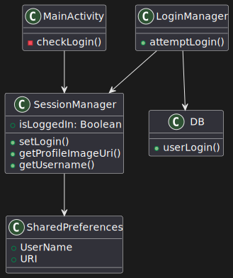
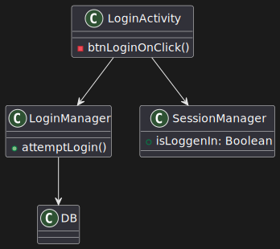

### PROGETTO PSS/Programmazione sistemi Mobili 
    Broccoli Gabriele
    Stefani Tommaso
# Analisi dei Requisiti - Sports Tracker
L'applicazione che si intende sviluppare è un'app di monitoraggio sportivo. Essa si occuperà di tracciare le attività sportive dell'utente, in particolare le sessioni di corsa e bicicletta, e fornire informazioni dettagliate sui percorsi effettuati, come la distanza coperta, le calorie bruciate e la durata.
L'utente potrà salvare e consultare i dati delle sessioni passate per tenere traccia dei propri progressi nel tempo.
## Requisiti Funzionali
- L'app deve permettere di avviare e terminare una sessione di allenamento. Durante la sessione, sarà necessario raccogliere dati sulla posizione dell'utente per tracciare il percorso.

- Alla fine di una sessione, l'utente deve poter vedere su una mappa il percorso seguito durante l'allenamento.
- L'utente deve avere la possibilità di salvare e rivedere le sessioni passate con tutte le informazioni relative, come il percorso, le calorie bruciate e il tempo impiegato.
- L'app deve gestire la registrazione e il login degli utenti, permettendo di mantenere una sessione attiva per facilitare l'accesso ai dati personali, o cambiare utente.
- L'app deve permettere agli utenti di impostare allenamenti programmati nel calendario per poi consultarli successivamente.
## Requisiti Non Funzionali
- L'app dev'essere sviluppata in modo da poter essere facilmente scalabile.

- Il sistema deve fornire un tracciamento preciso e veloce, in modo da rilevare correttamente i movimenti dell'utente in tempo reale.
- L'app deve offrire un'esperienza utente fluida e semplice, con un'interfaccia che permetta l'utilizzo da parte di tutti i tipi di utenti.
# Analisi e modello del dominio
#### User: 
rappresenta la persona che utilizza l'applicazione per monitorare i propri allenamenti. Ogni utente puà impostare i propri dati, come:
- Username e password
- Dati sulle proprie caratteristiche fisiche
- Un obiettivo fissato dall'utente, come dimagrire o migliorare la propria forma fisica.

#### TrainingSession:
ogni sessione rappresenta un allenamento dell'utente e contiene dati come:
- Giorno e ora in cui è stata effettuata la sessione.  
- Tempo totale dell'allenamento.  
- Distanza totale percorsa in m.  
- Tipologia di sport: corsa o bicicletta
#### Location:
rappresenta i punti geografici registrati durante un allenamento. Ogni punto è caratterizzato da:  
- Latitudine e longitudine 
- Ora esatta in cui è stato registrato il punto.
#### CalendarTraining:
ogni allenamento salvato dall'utente nel calendario. caratterizzati da:
- Data
- Descrizione
## Relazioni tra le entità
Un utente può avere diverse sessioni di allenamento.
Ogni sessione di allenamento ha un percorso associato.
### Sfide del dominio
La sfida principale è creare un'applicazione fruibile, in cui ogni pagina è facilmente raggiungibile e in cui l'utente ha il controllo sui propri dati e su quelli delle proprie sessioni. Inoltre tutti i percorsi degli allenamenti dovranno essere disegnati sulla stessa mappa, con colori differenti.

Un'altra delle principali difficoltà riguardante il tracciamento dei percorsi è la gestione accurata della posizione GPS e della registrazione dei dati in tempo reale, come la frequenza con cui i dati vengono raccolti e memorizzati

La home page inoltre dovrà mostrare tutti gli allenamenti dell'utente correntemente loggato.
La permanenza dello stato di login e la gestione dei dati dell'utente è un altro aspetto a cui presteremo particolare attenzione


# Design
## Architettura
La struttura dell'app segue il pattern Model-View-ViewModel (MVVM), che garantisce una separazione chiara tra la logica di business, la gestione dei dati e l'interfaccia utente. Le principali componenti dell'app interagiscono nel seguente modo:

- Model: Il Model rappresenta i dati e le operazioni di gestione legate alle sessioni di allenamento e agli utenti. Questo livello include l'accesso al database SQLite, che gestisce informazioni come le sessioni di allenamento e i dati degli utenti. Le operazioni sui dati vengono eseguite tramite repository, che incapsulano la logica di accesso e aggiornamento del database.

- View: La View è costituita dai frammenti e dalle attività dell'applicazione, che rappresentano l'interfaccia grafica con cui l'utente interagisce. Il layout di queste interfacce è pensato per essere semplice e intuitivo, permettendo all'utente di visualizzare le proprie sessioni di allenamento e di accedere rapidamente alle funzionalità principali.
- ViewModel: Il ViewModel funge da intermediario tra la View e il Model. Si occupa di esporre i dati necessari alla View in modo che questa possa osservarli e aggiornarli automaticamente quando cambiano. Ad esempio, il MapsViewModel gestisce i dati relativi alla posizione dell'utente durante l'allenamento, integrando i servizi di localizzazione tramite il FusedLocationProviderClient.
## Interazione tra le componenti
Sessione di allenamento: L'utente avvia una nuova sessione di allenamento tramite l'interfaccia utente. La View comunica con il MapsViewModel per avviare il tracciamento della posizione. Il MapsViewModel, a sua volta, utilizza il Model per salvare e recuperare i dati relativi alla sessione, che sono gestiti dal database SQLite.

Gestione dell'utente: L'autenticazione e la gestione della sessione di login sono affidate a SessionManager. Questo viene utilizzato per mantenere la sessione dell'utente attiva tra le varie esecuzioni dell'applicazione, evitando di richiedere all'utente di effettuare nuovamente il login ogni volta che riapre l'app.
Le modifiche allo stato dell'utente vengono propagate al ViewModel, che aggiorna la View di conseguenza.
# Design dettagliato - Broccoli Gabriele
## MapsFragment 
#### Problema:
L'app deve tracciare il percorso di allenamento degli utenti, mostrandolo su una mappa. È inoltre necessario gestire la geolocalizzazione, il salvataggio delle coordinate, e l'aggiornamento continuo della posizione dell'utente durante l'allenamento.
#### Soluzione:
Ho implementato un MapsFragment che utilizza FusedLocationProviderClient per ottenere la posizione dell'utente in tempo reale e visualizzare il percorso su una mappa di Google. Questo fragment è separato dalla logica di business grazie all'uso di MapsViewModel, che gestisce i dati e li aggiorna nel fragment e nel DB.
#### Pattern Utilizzati:  
MVVM (Model-View-ViewModel): Il MapsViewModel mantiene lo stato del percorso di allenamento e gestisce le interazioni con i dati. Le interazioni con il servizio di localizzazione sono gestite da MapsFragment.  
Observer Pattern: Il MapsFragment osserva i dati nel MapsViewModel, aggiornando la mappa ogni volta che i dati degli allenamenti cambiano.
#### Motivazioni:  
L'utilizzo di MVVM consente una migliore organizzazione del codice, separando le responsabilità.  
Il pattern Observer garantisce che la mappa sia aggiornata automaticamente quando i dati cambiano.
#### UML:


Nello schema UML, MapsFragment interagisce con MapsViewModel per osservare e caricare i dati degli allenamenti.  
MapsFragment interagisce con i server Google per ottenere i dati di localizzazione.
## TrainingSessionAdapter
#### Problema:
L'app ha bisogno di una lista che mostri tutte le sessioni di allenamento registrate dall'utente. Ogni sessione deve essere rappresentata con un layout che visualizzi le informazioni e con un bottone per eliminare la sessione.
#### Soluzione:
Ho implementato un TrainingSessionAdapter che gestisce la visualizzazione delle sessioni di allenamento in una RecyclerView.TrainingSessionAdapter prende i dati dal DB insieme alla funzione di eliminazione allenamento e li passa alla RecyclerView per visualizzarli.
#### Pattern Utilizzati:
Adapter Pattern: TrainingSessionAdapter segue il pattern Adapter per gestire la visualizzazione delle sessioni di allenamento all'interno di una RecyclerView, rappresentando i dati in modo intuitivo.
#### Motivazioni:  
L'uso di un Adapter facilita la gestione dei dati in una RecyclerView, fornendo un modo flessibile di visualizzare, aggiornare ed eliminare le sessioni di allenamento.
#### UML:


Lo schema UML mostra la relazione tra TrainingSessionAdapter, RecyclerView, e TrainingSession, evidenziando come l'adapter media tra i dati e l'interfaccia utente.
## DB
#### Problema:
L'applicazione deve salvare in modo persistente i dati delle sessioni di allenamento, associando tali sessioni agli utenti. È necessario poter salvare, modificare, eliminare e recuperare i dati relativi a queste sessioni e agli utenti in modo efficiente.
#### Soluzione:
Ho implementato una classe DB per gestire l'accesso al database SQLite. Questa classe segue il pattern Repository per separare la logica del database dall'interfaccia utente. Ciò consente un'interazione facile con i dati senza dover gestire direttamente le query SQLite all'interno dell'activity o dei fragment.
#### Pattern Utilizzati:
Repository Pattern: La classe DB funge da repository centrale, gestendo l'accesso ai dati tramite metodi per creare, leggere, aggiornare e cancellare sessioni di allenamento e utenti. Questo pattern migliora la modularità e consente di astrarre il dettaglio implementativo del database.  
Singleton: DB viene inizializzato una sola volta per garantire che vi sia una sola istanza che gestisce l'accesso al database, evitando accessi concorrenti e centralizzando le operazioni.
#### Motivazioni: 
L'utilizzo del pattern Repository con un database SQLite offre una struttura ben organizzata per la persistenza dei dati. Questo approccio facilita anche l'aggiunta di nuove funzionalità, come la gestione di ulteriori tipi di dati, poiché è possibile estendere la classe DB senza influenzare il resto dell'applicazione.
#### UML:


Lo schema UML mostra la relazione tra la mia classe DB e il reale database sottostante, evidenziando come il repository gestisce l'accesso ai dati senza influenzare direttamente il database.
# Design dettagliato - Stefani Tommaso
### SessionManager - LoginManager
#### Problema:
Quando un utente riapre l'app non deve essere obbligato a rifare il login ogni volta.
Bisogna quindi gestire le sessioni utente, memorizzando in modo persistente lo stato di login dell'utente, lo userName e l'URI dell'immagine profilo.
#### Soluzione:
SessionManager utilizza le SharedPreferences per salvare i dati principali della sessione dell'utente. Questo permette recuperare le informazioni in modo più facile dalle altre componenti del programma, e di recuperare lo stato di login anche dopo la chiusura dell'app.
#### Pattern utilizzato
SessionManager è implementato come singleton per garantire che ci sia solo un'istanza che gestisce lo stato di sessione dell'utente, evitando conflitti.
#### UML


SessionManager gestisce lo stato di login e le informazioni dell'utente, come il nome e l'immagine del profilo, utilizzando SharedPreferences. Permette di accedere in modo centralizzato a questi dati.

### UserFragment
#### Problema:
L'utente deve poter visualizzare e modificare le informazioni del proprio profilo, comprese l'immagine e i dati personali. È necessario anche gestire la persistenza delle modifiche effettuate, e il logout.
#### Soluzione:
UserFragment fa visualizzare i dati dell'utente e la sua immagine profilo(se precedentemente impostata) e ne consente le modifiche tramite EditUserActivity.

Gli utenti possono scegliere un'immagine dalla galleria e salvarla.  
L'utente può disconnettersi tramite il pulsante apposito.
#### Pattern utilizzato
MVVM: UserFragment utilizza un ViewModel per gestire i dati, mantenendo separata l'interfaccia utente dalla logica di aggiornamento e recupero dei dati del profilo.
#### UML


UserFragment gestisce la visualizzazione e l'aggiornamento delle informazioni personali dell'utente, come i dettagli del profilo e l'immagine, fornendo una UI aggiornata automaticamente quando i dati vengono modificati.
### CalendarFragment
#### Problema:
L'utente deve poter visualizzare e salvare allenamenti per le date selezionate nel calendario. Deve inoltre permettere all'utente di vedere se esistono allenamenti precedenti per quella data e aggiungere nuovi allenamenti.
#### Soluzione:
CalendarFragment consente all'utente di interagire con un calendario e salvare sessioni di allenamento per date specifiche.
#### Pattern utilizzato
MVVM: CalendarFragment utilizza un ViewModel per gestire i dati del calendario, separando l'aggiunta degli allenamenti al DB dalla UI.
#### UML


CalendarFragment permette agli utenti di selezionare una data e visualizzare o salvare degli allenamenti, aggiornadno la UI in tempo reale.
### LoginActivity
#### Problema
Permette di eseguire un accesso all'app senza dover necessariamente passare da WelcomeActivity se l'utente è già stato creato
#### Soluzione
Permette all'utente di inserire le credenziali e, tramite il LoginManager, verifica se il login è corretto. I dati dell'utente vengono gestiti dal SessionManager per mantenere l'utente autenticato
#### Pattern utilizzato
gestisce il processo di login e aggiorna lo stato di autenticazione utilizzando direttamente nell'activity per un fattore di semplicità.
#### UML


LoginActivity consente all'utente di autenticarsi inserendo nome utente e password. Le credenziali vengono verificate tramite il LoginManager, e se valide, l'utente viene autenticato e viene re-impostato la condizione per il mantenimento del login.
# Sviluppo
## Testing Automatizzato
Sono state testate le seguenti componenti:  

- **Database (DB):**
Verifica dell'avvenuta modifica, inserimento, recupero ed eliminazione di dati nel DB.  

- **LoginManager:**
controlla che i dati dell'utente vengano verificati correttamente durante la richiesta di login. 

- **SessionManager:**
Controlla la corretta assegnazione dello stato di login e del nome utente, e assicura che i dati vengano memorizzati correttamente in SharedPreferences.  
### Strumenti Utilizzati
**JUnit 5:** Per i test unitari di classi e metodi.  
**Mockito:** Utilizzato per simulare dipendenze nelle classi dove necessario.  
**Roboelectric:** simulazione componenti di android come context e SharedPreferences
## Note di sviluppo - Broccoli Gabriele
### Descrizione salvataggio posizioni, recupero e tracciamento grafico allenamenti
```kotlin
private fun startLocationUpdates() {
    // crea un callback per ricevere aggiornamenti della posizione
    locationCallback = object : LocationCallback() {
        override fun onLocationResult(locationResult: LocationResult) {
            super.onLocationResult(locationResult)
            // itera attraverso le nuove posizioni ricevute
            for (location in locationResult.locations) {
                // aggiorna la posizione corrente nell'interfaccia utente e nella logica
                updateLocation(location)
                // salva ogni nuova posizione nel database
                saveLocationToDatabase(location) // Salva ogni nuova posizione nel database
            }
        }
    }

    /* Controllo e richiesta dei permessi */

    fusedLocationClient.requestLocationUpdates(locationRequest, locationCallback, Looper.getMainLooper())
}
```
- Metodo che avvia gli aggiornamenti della posizione e salva ogni nuova posizione nel database. La sincronizzazione in tempo reale delle posizioni con il database permette di recuperare facilmente le sessioni di allenamento anche dopo la chiusura dell'app.

```kotlin
private fun updateLocation(location: android.location.Location) {
    val newLocation = Location(
        latitude = location.latitude,
        longitude = location.longitude,
        timestamp = System.currentTimeMillis()
    )
    if (locationList.isNotEmpty()) {
        val lastLocation = locationList.last() //prende dati ultima posizione
        val distanceToLast = // calcola la distanza dall'ultima posizione
        val timeDifference = // calcola il tempo trascorso dall'ultima posizione
        if (timeDifference > 0) {
            //calcola velocità e la mostra a schermo
        }
    }
    locationList.add(newLocation)
    saveLocationToDatabase(newLocation) // salva la nuova posizione sul db
}
```
- Il metodo updateLocation aggiorna la lista delle posizioni e salva la nuova posizione nel database. Questo approccio consente di mantenere traccia della cronologia delle posizioni e di recuperarle successivamente.

```kotlin
fun loadAllUserTrainings() {
    val userName = sessionManager.userName
    // prende sessioni di allenamento dal db
    val trainings = userName?.let { db.getAllTrainingsByUserId(it) }

    // inizializza una lista per contenere le opzioni delle polyline
    val polylineOptionsList = mutableListOf<PolylineOptions>()
    
    // itera attraverso gli allenamenti recuperati
    trainings?.forEach { training ->
        // per ogni allenamento recupera le locations
        val locations = db.getLocationsByTrainingId(training.sessionId.toLong())
        
        // crea una polyline
        if (locations.isNotEmpty()) {
            val color = getRandomColor()
            val polylineOptions = PolylineOptions()
                .addAll(locations) // aggiungi tutte le posizioni alla polyline
                // imposta larghezza, colore e tipo di polyline

            polylineOptionsList.add(polylineOptions)
        }
    }

    // posta la lista di polyline come valore osservabile
    _userTrainings.postValue(polylineOptionsList)
}
```

- Funzione di MapsViewModel che genera ed espone le polilinee come elemento osservabile da MapsFragment


```kotlin
viewModel.loadAllUserTrainings().observe(viewLifecycleOwner) { locations ->
    drawUserTrainings(locations) // disegna le posizioni recuperate dal DB sulla mappa
}
```
- Questo codice recupera tutte le posizioni salvate nel database e le disegna sulla mappa.

```kotlin
private fun drawUserTrainings(polylineOptionsList: List<PolylineOptions>) {
    val bounds = LatLngBounds.Builder()
    
    // aggiunge ogni polilinea alla mappa
    polylineOptionsList.forEach { polylineOptions ->
        map.addPolyline(polylineOptions)
        
        // includi tutti i punti della polilinea nei confini della mappa
        polylineOptions.points.forEach { bounds.include(it) }
    }

    if (polylineOptionsList.isNotEmpty()) {
        // muove la camera per adattarla ai confini delle polilinee aggiunte
        map.moveCamera(CameraUpdateFactory.newLatLngBounds(bounds.build(), 100))
    }
}
```
- In dettaglio il metodo che disegna una polilinea sulla mappa utilizzando le posizioni recuperate dal database.

Risorse utilizzate:  
https://developers.google.com/maps/documentation/android-sdk/polygon-tutorial  
https://developer.android.com/develop/sensors-and-location/location/retrieve-current  
https://developer.android.com/topic/libraries/architecture/livedata  
https://codelabs.developers.google.com/codelabs/while-in-use-location#3


## Note di sviluppo - Stefani Tommaso

### Salvataggio dell'immagine con utilizzo di bitmap
#### com.broccolistefanipss.sportstracker.fragment.user.UserFragment
#### dove: https://stackoverflow.com/questions/41976885/cant-load-image-from-saved-uri-in-shared-preferences

#### Snippet

```kotlin
private fun saveProfileImage(bitmap: Bitmap) {
    try {
        val userName = sessionManager.userName ?: return
        val filename = "profile_picture_${System.currentTimeMillis()}.jpg"
        val contentValues = ContentValues().apply {
            put(MediaStore.Images.Media.DISPLAY_NAME, filename)
            put(MediaStore.Images.Media.MIME_TYPE, "image/jpeg")
            put(MediaStore.Images.Media.RELATIVE_PATH, "Pictures/ProfilePictures")
        }

        val imageUri = requireContext().contentResolver.insert(MediaStore.Images.Media.EXTERNAL_CONTENT_URI, contentValues)

        imageUri?.let { uri ->
            requireContext().contentResolver.openOutputStream(uri)?.use { stream ->
                bitmap.compress(Bitmap.CompressFormat.JPEG, 100, stream)
            }
            sessionManager.saveProfileImageUri(uri, userName)
        }
    } catch (e: Exception) {
        Toast.makeText(requireContext(), "Errore nel salvataggio dell'immagine", Toast.LENGTH_SHORT).show()
    }
}
```

#### Descrizione:
Nel metodo saveProfileImage, viene creata una cartella "ProfilePictures" utilizzando l'API di archiviazione di Android, ovvero il MediaStore, specificando il percorso relativo, impostato su "Pictures/ProfilePictures", che indica la destinazione del file all'interno del dispositivo.
L'uri dell'immagine viene salvato nelle SharedPreferences per utilizzi futuri

L'immagine viene decostruita in un OutputStream di bit e ricostruita per avere ogni immagine come JPEG riducendo la dimensione e standardizzando tutte le immagini inserite

### Salvataggio dell'immagine del profilo tramite URI

#### dove com.broccolistefanipss.sportstracker.manager.SessionManager

#### Snippet

```kotlin
fun saveProfileImageUri(uri: Uri?, userName: String?) {
    userName?.let {
        editor.putString("profile_image_uri_$it", uri?.toString())
        editor.apply()
    }
}
```
#### Descrizione:
Questo metodo salva l'URI dell'immagine nelle SharedPreferences utilizzando una chiave dinamica che include il nome utente per assicurare che ogni utente possa avere un'immagine di profilo unica.

### Salvataggio allenamento in una determinata data

#### dove: com.broccolistefanipss.sportstracker.fragment.calendar.CalendarFragment

#### Snippet

```kotlin
private fun checkForExistingTraining(date: String) {
        calendarViewModel.calendarTrainingSessions.value?.let { sessions ->
            val training = sessions.find { it.date == date }
            if (training != null) {
                // format data italiana
                val formattedDate = try {
                    val localDate = LocalDate.parse(date)
                    String.format("%02d-%02d-%04d", localDate.dayOfMonth, localDate.monthValue, localDate.year)
                } catch (e: DateTimeParseException) {
                    date // in caso di errore, mostra la data nel formato originale
                }

                binding.textViewTrainingDetails.apply {
                    text = context.getString(R.string.allenamento_per_data, formattedDate, training.description)
                    visibility = View.VISIBLE
                }
            } else {
                binding.textViewTrainingDetails.visibility = View.GONE
            }
        }
    }
```

#### Descrizione
Questo metodo utilizza un try-catch per gestire il parsing della data. Se la data non è formattata correttamente (se viene inserita una data non valida), il codice non si arresta, ma gestisce l'errore e visualizza la data originale.

# Commenti finali
## Autovalutazione - Broccoli Gabriele
### Punti di forza
- Ho gestito diverse componenti chiave del progetto, tra cui MainActivity, la gestione del database, MapsFragment, HomeFragment, TrainingSessionAdapter, NewTrainingActivity, e botmenu activity. Ogni parte ha richiesto un buon livello di comprensione e implementazione di concetti avanzati.  

- Ho scritto test unitari utilizzando Robolectric e Mockito, coprendo diverse funzionalità e garantendo che il codice fosse ben testato, soprattutto per la gestione delle sessioni e delle chiamate al DB.

- Ho contribuito in modo significativo alla stesura della documentazione, con particolare attenzione alle linee guida fornite.

### Punti di debolezza
- Non abbiamo fatto particolare attenzione all'uso delle risorse del dispositivo, anche se non ci sono stati particolari problemi di prestazioni o consumo di batteria durante i nostri test.

- Avrei voluto implementare altre funzioni come ad esempio la generazione di grafici personalizzati per ogni utente in base ai dati dei propri allenamenti e ai propri obiettivi, un calcolo delle calorie più realistico e la condivisione tramite social.

- Abbiamo letto la documentazione sulla relazione solo dopo aver sviluppato il progetto. Tornando indietro avrei fatto le due cose contemporaneamente

- Ho testato manualmente le funzioni di tracciamento della polyline e aggiornamento posizione in mapsFragment perchè non sono riuscito a testarle in modo automatizzato
### Ruolo nel gruppo
Il mio ruolo all'interno del gruppo è stato focalizzato principalmente sulla parte tecnica, organizzativa e sull’implementazione delle funzionalità principali dell'applicazione.  
Mi sono occupato della gestione dei dati, dell’integrazione della mappa e del sistema di tracciamento del percorso, della struttura dell'applicazione.

Abbiamo in ogni caso lavorato a stretto contatto durante tutto lo sviluppo del progetto.

### Lavori futuri
Negli sviluppi futuri, lavorerei per migliorare la gestione delle risorse e del nostro tempo, attraverso uno sviluppo più documentato e facendo più testing automatizzati.  
Potrei anche concentrarmi di più sull’esperienza utente, basandomi sui feedback di utenti reali.

## Autovalutazione - Stefani Tommaso
Nella mia parte del progetto, il mio contributo principale è stato nella gestione delle funzionalità legate all’autenticazione, alla gestione delle sessioni e alla creazione delle interfacce utente per la WelcomeActivity e la LoginActivity.

Mi sono concentrato sull'uso del pattern MVVM, quando applicabile.
### Punti di forza
- Capacità di applicare il pattern MVVM in CalendarFragment, separando la logica dalla UI.

- Implementazione della gestione delle sessioni con il SessionManager e l'utilizzo dell'URI per il salvataggio delle immagini del profilo.

- Buona gestione del lavoro in gruppo, coordinazione nello sviluppo delle funzionalità
### Punti di debolezza
- Avrei potuto approfondire l'uso dei ViewModel anche in altre attività, come WelcomeActivity per mantenere un approccio più uniforme.

- Parte di testing migliorabile 

- L'immagine del profilo non è scalabile nelle dimensioni, e manca la possibilità di selezionarne solo porzioni.

### Ruolo nel gruppo
Durante tutto lo sviluppo dell'applicazione abbiamo sempre lavoranto insieme sia per confronti che per semplicità nella comunicazione. Io in particolare mi sono concentrato principalmente sulle sezioni riguardanti l’autenticazione e la gestione delle sessioni, oltre alla parte di design dettagliato per alcune attività.

### Sviluppi futuri
- Utilizzo maggiore di testing automatizzato
- Utilizzo maggiore dei viewmodel per rendere il codice più lineare
- Aggiunta di uno stile personalizzato al calendario per renderlo più accattivante
- Rivedere lo stile generale dell'applicazione per migliorare la user experience.

# Guida Utente
Seppur migliorabile, l'app risulta molto intuitiva e il suo utilizzo non dovrebbe richiedere particolari guide.
